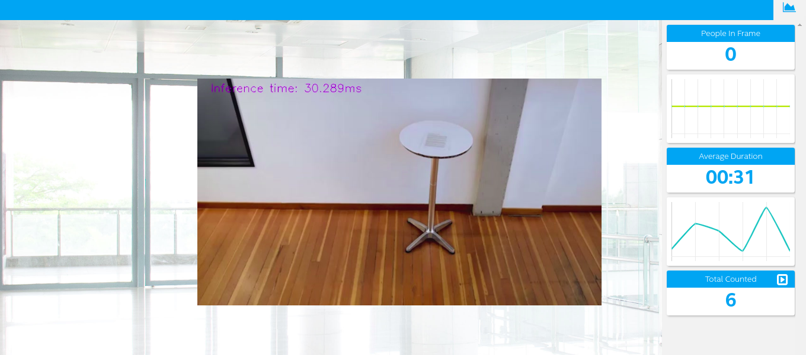

# Project Write-Up


## Explaining Custom Layers
--- 

The Model Optimizer searches each layer of the input model in the list of known layers before building the internal representation of the model, optimizing the model, and producing the intermediate Representation.
Custom layers are layers that are not included in a list of known openvino layers. If your topology contains layers that are not in the list of known layers, the Model Optimizer classifies them as custom.
the process behind converting custom layers involves adapting unknown layers to the optimization process and doing the intermediate representation using the inference engine
The list of known layers is different for each of the supported frameworks in my case I will use the tensorflow framework
Some of the potential reasons to handle custom layers are for when you implement your own layers from scratch, as maybe you may have some specific problem that you can only solve with a customization or layer creation


## The model 

- SSD Mobilenet: [ssd_mobilenet_v1_0.75_depth_coco]
  - The model was obtained from [Here](http://download.tensorflow.org/models/object_detection/ssd_mobilenet_v1_0.75_depth_300x300_coco14_sync_2018_07_03.tar.gz)


  - I converted the model to an Intermediate Representations with the followings arguments...
      
      - mobilenet with the normal optimize
         - python /opt/intel/openvino/deployment_tools/model_optimizer/mo.py --input_model frozen_inference_graph.pb --tensorflow_object_detection_api_pipeline_config pipeline.config --reverse_input_channels --tensorflow_use_custom_operations_config /opt/intel/openvino/deployment_tools/model_optimizer/extensions/front/tf/ssd_v2_support.json

      

      - mobilenet with the FP16 version
         - python /opt/intel/openvino/deployment_tools/model_optimizer/mo.py --input_model         frozen_inference_graph.pb --tensorflow_object_detection_api_pipeline_config pipeline.config --reverse_input_channels --tensorflow_use_custom_operations_config /opt/intel/openvino/deployment_tools/model_optimizer/extensions/front/tf/ssd_v2_support.json --data_type FP16

      

## Comparing Model Performance
---

The model execution time before being optimized, is given in ms for 600x600 images (larger than those used in the project (768x432)). The video card used is an Nvidia GeForce GTX TITAN X

### The difference between models 

```
             / Pre-optimize    / Normal optimize     / FP16
-pt          / ----            / 0.6                 / 0.5
count_persons/ ----            / 7                   / 6
time         / 26ms            / 27-29ms             / 27-28ms
size         / 18.5 MB.pb      / 79.8 kB.xlm         / 79.8 kB.xlm
             /                 / 8.2 MB.bin          / 8.2 MB.bin

```

you can find the statistics of the pre-optimized model [here](https://github.com/tensorflow/models/blob/master/research/object_detection/g3doc/detection_model_zoo.md)

As we can see the difference is incredible, although the pre-optimized model has a better time than the optimized ones, this is almost insignificant, while its weight is much higher than the optimized ones, and taking into account that the execution time of  pre-optimized model are made on an gpu Nvidia GeForce GTX TITAN X  and the execution times of the optimized model are from the workspace

## Assess Model Use Cases
--- 

some possible uses for a people counter application are

* Count the number of people entering and leaving a certain store and said count can be used to warn if there is a high concentration or low concentration of people in the area due to the coronavirus pandemic. This could alert the security forces to immediately go to disperse people to avoid further contagion.
* Count number of people in shopping malls to have an understanding of the flow of customers, if you add a product identifier to this you could count the number of people who bought something and those who did not. This could give us an idea of the effectiveness of sales in stores.

## Assess Effects on End User Needs
---

Lighting, model accuracy, and camera focal length / image size have different effects on a
deployed edge model. The potential effects of each of these are as follows

* Lighting -> bad lighting can make the model's precision drop and make incorrect predictions in our edge app, the same thing happens when we want to identify people or objects in the dark

* Model accuracy -> a model with low precision will result in incorrect predictions, therefore the more precision is better

* Focal camera -> the focal length is something important since when working in computer vision different curvatures present in the images can affect the performance of models that have not been previously trained with these focal curvatures

* length / image size -> image length and size are important for models that have a specific input type, such as the famous 32n32x3 images from mnist


## Model Research
---


